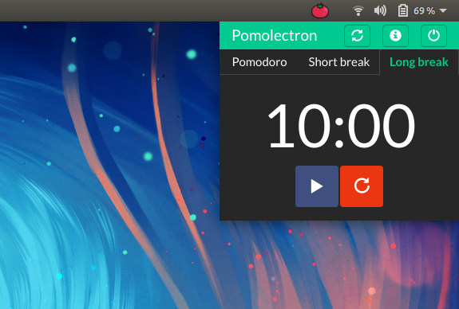

<h1 align="center">
  <br>
  <a href="https://github.com/amitmerchant1990/pomolectron"></a>
  <br>
</h1>

<h4 align="center">A <a href="https://en.wikipedia.org/wiki/Pomodoro_Technique" target="_blank">pomodoro</a> app for your menubar/tray.</h4>

<p align="center">
  <a href="https://badge.fury.io/js/pomolectron">
    
  </a>
  <a href="https://chocolatey.org/packages/pomolectron">
    
  </a>
  <a href="https://saythanks.io/to/amitmerchant1990">
    
  </a>
  <a href="https://www.paypal.me/AmitMerchant">
    
  </a>
  
</p>

|  macOS            |  Windows |
|---------------------|----------------------|
| |  |

## Key Features

* Pomodoro, Short break and Long break timers
* Notifies via a system notification when time is up
* Lives in a tray/menubar
* Cross platform
  - Windows, macOS and Linux ready.

<a href="https://www.patreon.com/amitmerchant">
	
</a>


## Dark Mode

<div align="center"></div>
  
## How To Use

To clone and run this application, you'll need [Git](https://git-scm.com) and [Node.js](https://nodejs.org/en/download/) (which comes with [npm](http://npmjs.com)) installed on your computer. From your command line:

```bash
# Clone this repository
$ git clone https://github.com/amitmerchant1990/pomolectron

# Go into the repository
$ cd pomolectron

# Install dependencies
$ npm install

# Run the app
$ npm start
```

On macOS, you can install Pomolectron via [cask](http://caskroom.io/).

```bash
$ brew cask install pomolectron 
```

On Windows, you can install Pomolectron via [chocolatey](https://chocolatey.org) as well.

```bash
C:\> choco install pomolectron
```

Note: If you're using Linux Bash for Windows, [see this guide](https://www.howtogeek.com/261575/how-to-run-graphical-linux-desktop-applications-from-windows-10s-bash-shell/) or use `node` from the command prompt.

## Download

You can [download](https://github.com/amitmerchant1990/pomolectron/releases/tag/v1.1.0) the latest installable version of Pomolectron for Windows, Linux and macOS.

You can also get the [Windows binaries](http://www.softpedia.com/get/Others/Miscellaneous/Pomolectron.shtml) from Softpedia.


## News
Pomolectron was [trending](https://news.ycombinator.com/item?id=13878898) on the Hacker News and on [GitHub](https://raw.githubusercontent.com/amitmerchant1990/test/master/trending.JPG) during the day of its launch.

## You may also like..

- [Markdownify](https://github.com/amitmerchant1990/electron-markdownify) - Markdown Editor desktop app

## License

MIT

---

> [amitmerchant.com](https://www.amitmerchant.com) &nbsp;&middot;&nbsp;
> GitHub [@amitmerchant1990](https://github.com/amitmerchant1990) &nbsp;&middot;&nbsp;
> Twitter [@amit_merchant](https://twitter.com/amit_merchant)
